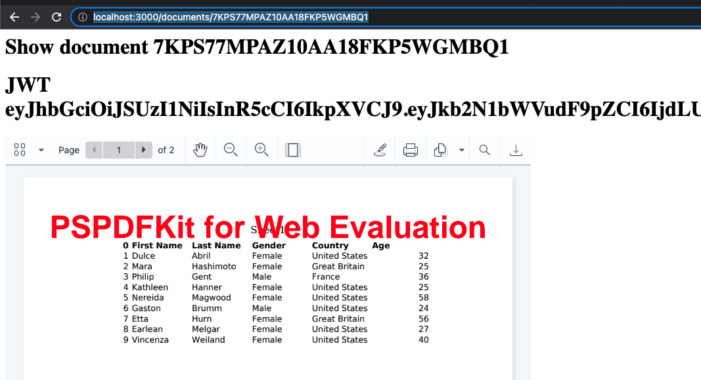

# pre-require
Run pspdfkit server
1. read the document: https://pspdfkit.com/getting-started/server/?product=server&integration=http&backend=nodejs&project=new-project
2. mkdir new folder
3. create `docker-compose.yml` file and past example file in document
4. `docker-compose.yml` run pspdfkit server

If it's work, you are able visit `http://localhost:5000/dashboard`
- username: `dashboard`
- password: `secret`

## ignore document start from **step6**, already implement by by this project
## install & run
1. git clone
2. cd foldername
3. `npm i`
4. `npm start`

## How to test
1. Upload an office file via `http://localhost:5000/dashboard`, then will get a document Id, e.x. `7KPS77MPAZ10AA18FKP5WGMBQ1`
2. visit: `http://localhost:3000/documents/7KPS77MPAZ10AA18FKP5WGMBQ1`
 
## screenshots
